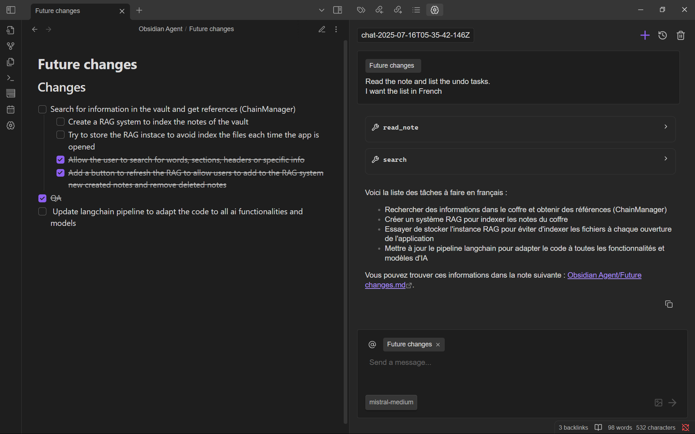

<h1 align="center">Obsidian Agent</h1>

  Lend your vault to an AI agent. Read, write, and search your notes with AI. 

  

    
    
  

  

    
  

## 🚀 Overview
A simple and lightweight AI extension for Obsidian. Delegate basic tasks to an agent that can write, edit, and create notes and folders within your vault.

It features a user-friendly UI, inspired by other agentic apps.

  

## 🧠 Getting Started

1. Download the plugin cloning the repository inside your `~/vault/.obsidian/plugins/` or downloading the plugin from **Community Plugins** in Obsidian (soon).
2. Enable the plugin from Obsidian's settings panel.
3. Add the corresponding API keys in the plugin's settings panel.

> Make sure you have an API key from one of the supported providers: [supported providers](./docs/providers.md).

## ✨ Core Features
<ul>
  <li><b>Note Reading:</b> Understands and edit your notes.</li>
  <li><b>Customizable:</b> Tweak settings and agent rules to fit your workflow.</li>
  <li><b>Different providers:</b> Work with your favorite LLM providers.</li>
</ul>

## 🛠️ Tools

The agent can use the following tools to interact with your vault:

- **Create note**: Create a new note in your vault, e.g: *Create a note titled 'Project Ideas'*
- **Read note**: Read the content of a note, e.g: *Read the active note*
- **Edit note**: Edit an existing note, e.g: *Add a summary of this text: [...] to the note 'Book Review'*
- **Create folder**: Create a new directory/folder, e.g: *Create a folder called '2024 Plans'*
- **List files**: List files in a directory, e.g: *List all files in the folder 'Research'*
- **Search**: Search for content across your vault, e.g: *Search if it exist a note called 'AI agent'*

## 🟡 Disclosures
This plugin connects to remote AI services to process your requests.

> **Why is this needed?**  
> The AI models that power these features run on external servers and require an internet connection. Your notes or queries are sent securely to the selected provider for processing, and the results are only returned to your vault.

To use these AI services, you must provide an API key for your chosen provider: [supported providers](./docs/providers.md). You can choose which provider to use, and you are responsible for obtaining and managing your API keys.

## 🫱🏼‍🫲🏼 Contributing & Support

- Found a bug? Open an issue [here](https://github.com/TheManuelML/obsidian-agent/issues).  
- Want to contribute? Create a new pull request.
> *Note: Not all models were tested. Bugs may occur*
