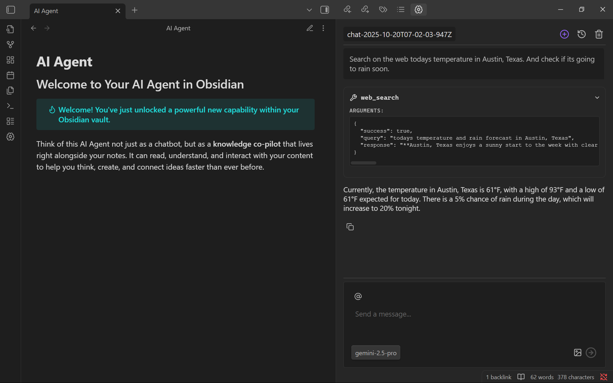

<h1 align="center">Obsidian Agent</h1>

  Lend your vault to an AI agent. Read, write, and search your notes with AI. 

  

    
    
    
  

  

    
    
  

## 🚀 Overview
A simple and lightweight AI extension for Obsidian. Delegate basic tasks to an agent that can write, edit, and create notes and folders within your vault.

It features a user-friendly UI, inspired by other agentic apps.

## 🧠 Getting Started

1. Download from **Community Plugins** in Obsidian or clone the repository inside your `~/vault/.obsidian/plugins/` folder.
2. Enable the plugin from Obsidian's settings panel.
3. Add the corresponding Google API key in the plugin's settings panel.

> [!IMPORTANT]  
> Additionally you can add a custom URL to get connected to google services. Also, make sure you have a valid Google API key with the Gemini service enable. 

Start chating with the agent by locating  and clicking on the brain icon in the left and right sidebars. Or add a hotkey to kickly acces your most recent chat.

## 💬 Chats

Manage your chats as Obsidian notes. Rename the chat by renaming the file.

> [!CAUTION]  
> Chat files are design to store the chat history and the messages metadata. Do not modify or move them.

## 🛠️ Tools

The agent can use the following tools to interact with your vault:

- **Create note**: Create a new note in your vault.   
e.g: *Create a note titled 'Project Ideas'*
- **Read note**: Read the content of a note.  
e.g: *Read the active note*
- **Edit note**: Edit an existing note.  
e.g: *Add a summary of this text: [...] to the note 'Book Review'*
- **Create folder**: Create a new folder.  
e.g: *Create a folder called '2024 Plans'*
- **List files**: List files in a folder.  
e.g: *List all files in the folder 'Research'*
- **Vault Search**: Search for content across your vault.  
e.g: *Search if it exist a note called 'AI agent'*
- **Note filtering**: Return note paths that fall inside a date range.  
e.g: *Give me yesterday's notes*
- **Web search**: Search for content on the web.  
e.g: *Search on the web for todays temperature in Austin, Texas*

Also you can right click over selected text, in your markdown notes, to `summarize selection` or `ask agent`.

And finally, you can also attach images by clicking the image icon, and notes with the `@` icon in the input.

## 🟡 Disclosures
This plugin connects to remote Google AI services to process your requests.

> **Why is this needed?**  
> The AI models that power these features run on external servers and require an internet connection. Your notes or queries are sent securely to the selected provider for processing, and the results are only returned to your vault.

To use these AI service, you must set a Google API key. You are responsible for obtaining and managing your API keys.

## 🫱🏼‍🫲🏼 Contributing & Support

- Found a bug? Open an issue [here](https://github.com/TheManuelML/obsidian-agent/issues).  
- Want to contribute? Create a new pull request.
